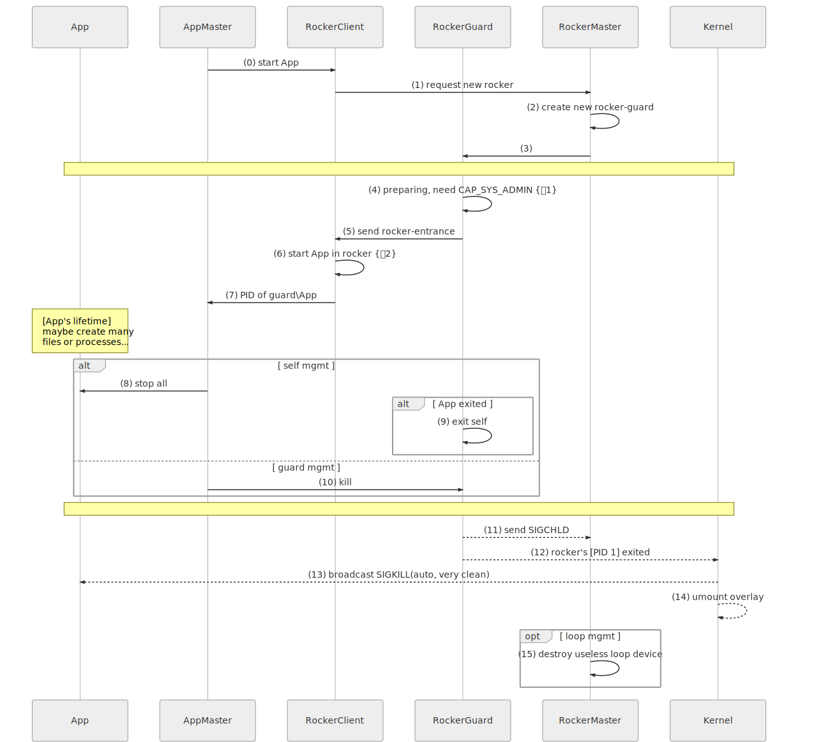
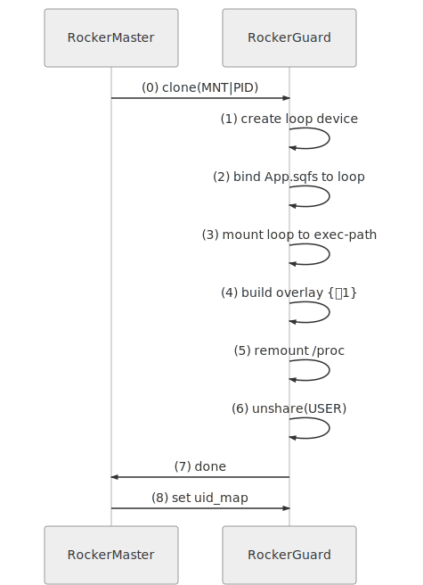
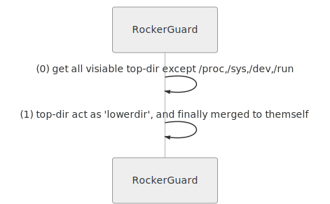
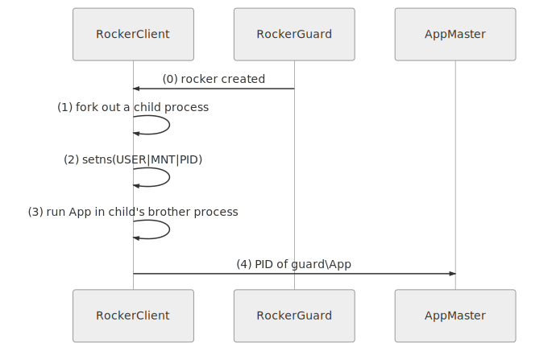
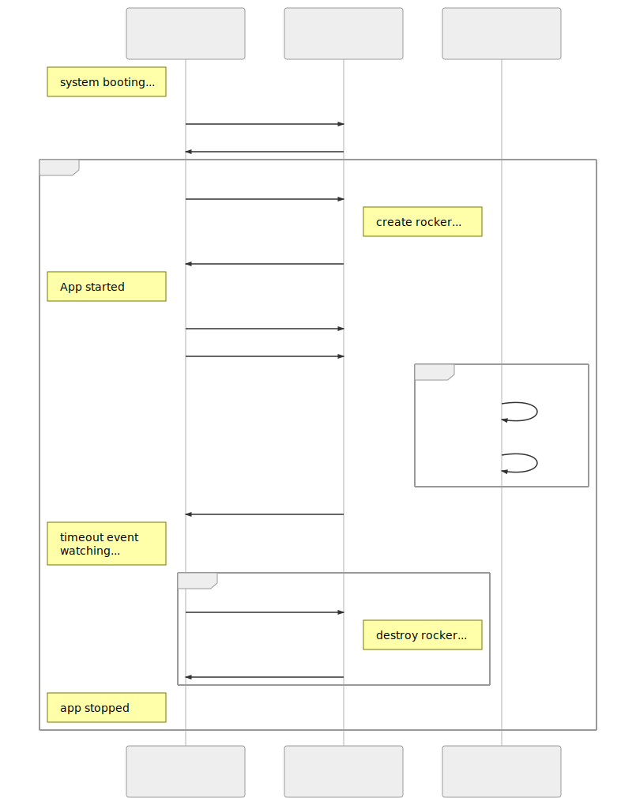

> **Contents**
>
> - ROCKER
>   - 1.1. 亮点与特性
>   - 1.2. 用户指南
>   - 1.3. 架构说明
>   - 1.4. 开发路线
>   - 1.5. BUG
>   - 1.6. 待办事宜

# 1. ROCKER

[**English Version**](./README_en.md)

ROCKER 是一个`在线解压`和`进程沙箱`实现, 针对的是基于 Linux 的资源受限的(`即使是 docker 这样的容器实现自身的资源占用都是不能容忍的`) IoT 系统, 旨在提高其资源利用率和系统安全性, 并且避免产生额外的性能开销.

通过将 App 程序文件及其它合适的文件压缩成`squashfs`包, 通常可以带来超过 60% 的磁盘空间节省, 这对于资源受限的 IoT 系统来说是非常有意义的. 与此同时, 由于 Linux 内核原生提供了动态按需解压支持, 相对于常规的 App 运行模式, 并不会产生额外的内存开销.

沙箱功能的安全性保证, 来自于`Linux namespaces/cgroups`, `overlayfs`, `Rust` 等基础设施, 以及大量的测试用例. 感谢 **linus 大神**, **Rust 团队**创造出这些伟大的基础设施.

> **本项目当前适合用于学习研究或教学目的, 不建议用于生产环境.**

## 1.1. 亮点与特性

- 比 Docker 更优异的性能和资源利用率, 启动容器不需要额外的镜像;
- client 库使用纯 C 开发, 裸金属开发模式, 除了 libc, 没有任何依赖;
- server 端(库)使用 rust 开发, 坚如磐石的稳定性, 媲美 C/C++ 的运行效率和内存利用率;
- 使用 crosstool-ng 组织交叉工具链, 可稳植性好, 稳定性高;
- 代码风格强制统一, 整洁优雅;
- 注重文档与测试;
- 更多亮点, 欢迎深入源码探索...

## 1.2. 用户指南

### 1.2.1. 代码结构(简略)

整个项目分成 Client 端与 Server 端两部分, 类似于一个传统的 CS 架构, Client 端以库的形式给调用方使用.

```shell
..
├── core/                     # [Rust 代码] 服务端核心逻辑实现
├── rocker_server/            # [Rust 代码] CS server 端实现
├── librocker_client/         # [C    代码] CS client 库实现
├── librocker_client_wrapper/ # [Rust 代码] 通过 ffi 封装的 librocker_client 库, 用于测试
├── tests/                    # [Rust 代码] 测试用例
├── README.md                 # 项目主文档
└── tools/
```


### 1.2.2. 环境配置与编译

#### 1.2.2.1. 环境需求

对应的官方说明文档, 链接如下:

- [rust](https://www.rust-lang.org/tools/install)
- [clang](http://clang.llvm.org)
- [crosstool-ng](http://crosstool-ng.github.io/docs/install/)

#### 1.2.2.2. 编译

理论上本项目可在任何 crosstool-ng 和 rust 支持的架构体系上编译并运行, 非 x86(_x64) 平台上默认静态链接 musl 或 uclibc 库, 以简化对运行环境的依赖.

如下以`TARGET=armv7-linux-musleabihf`为例:

```shell
# 编译安装, 安装路径是项目根目录内的 install_dir
make TARGET=armv7-linux-musleabihf release

# 功能测试
make TARGET=armv7-linux-musleabihf test

# 性能测试
make TARGET=armv7-linux-musleabihf bench
```

### 1.2.3. 客户端库

调用示例如下:

```C
// 由调用方定义的, 将在 ROCKER 中执行的回调函数及其参数
void *your_args = NULL;
int start_your_APP(void *args){};

// 初始化一个空白的 RockerRequest 结构体
RockerRequest req = ROCKER_request_new();

// 为 RockerRequest 结构体赋值
req.app_id = 1000;
req.uid = 1000;
req.gid = 1000;
req.app_pkg_path = "/tmp/your_APP.squashfs";
req.app_exec_dir = "/var/your_APP/execdir";
req.app_data_dir = "/var/your_APP/datadir";
req.app_overlay_dirs = { "/usr", "/var", "/etc", "/home", "/root" };

// 尝试在 ROCKER 中运行 APP
RockerResult res = ROCKER_enter_rocker(&req, start_my_APP, my_args);

if (ROCKER_ERR_success != res.err_no) {
    // 处理错误
}

// APP 运行结束, 清理环境
kill(res.guard_pid, SIGKILL);

// 更稳健的清理方法
RockerResult res2 = ROCKER_get_guardname(res.guard_pid);
if (ROCKER_ERR_success == res2.err_no && \
        0 == strcmp(res.guard_name, res2.guard.name)) {
    kill(res.guard_pid, SIGKILL);
}
```

详情参见 [librocker_client](./librocker_client/README.md).

## 1.3. 架构说明

以下将以'时序图'的形式论述具体的逻辑架构.

### 1.3.2. 时序图

|节点名称|定义|
|:-:|:-:|
|App|将要启动的前台业务进程|
|AppMaster|资源调度进程, App 大管家|
|RockerClient|提供给 AppMaster 使用的 client 库,</br>负责与 RockerMaster 及 RockerGuard 交互|
|RockerGuard|App 所在虚拟沙箱的 1 号进程, 由 RockerMaster 创建,</br>负责执行 '在线解压' 和 '虚拟沙箱' 机制的具体逻辑|
|RockerMaster|ROCKER 服务端资源调度接口|
|Kernel|Linux 内核|

**NOTE: RockerClient 通常与 AppMaster 属于同一进程, 文档中出于可读性的考虑, 对二者做了逻辑层面的拆分.**

#### 1.3.2.1. 概览



> (0) start App; (1) request new rocker

AppMaster 调用 RockerClient 的 API, 向 RockerMaster 请求创建新的 rocker, 并在其中运行指定的 App. 新 Rocker 的具体配置信息由 AppMaster 在其请求信息中指定.

> (2) create new rocker-guard

RockerMaster 收到请求, 创建一个新的 rocker 虚拟沙箱环境, 其中的 1 号进程就是 RockerGuard, RockerGuard 扮演的角色类似于常规 Linux 系统中的 init 或 systemd 进程, 若该进程退出, 即意味着其所在的虚拟沙箱环境的完全销毁(所有的进程及磁盘挂载都会被 Kernel 自动清理).

> (3)

RockerMaster 创建完对应的 RockerGuard 实例, 后续的与 AppMaster 的交互, 将由 RockerGuard 直接执行, RockerMaster 不再参与.

> (4) preparing, need CAP_SYS_ADMIN {＃1}

RockerGurad 根据 AppMaster 的要求, 创建对应的 rocker 环境, 此过程需要 CAP_SYS_ADMIN 能力或 root 权限, 具体的细节将在接下来的 1.3.1.1 节中描述.

> (5) send rocker-entrance

RockerGuard 将创建好的 rocker 入口, 发送给 RockerClient.

> (6) start App in rocker {＃2}

RockerClient 进入新创建的 rocker 环境, 在其中将 App 启动起来, 具体的细节将在 1.3.1.3 节中描述.

> (7) PID of guard\App

App 启动完成之后, RockerClient 将 Guard 及 App 的 PID 等相关信息返回 AppMaster, 以供 AppMaster 的后续管理. 至此, RockerClient 完成其在单次 App 启动中使命, 不再参与后续环节.

> (8) stop all; (10) kill

AppMaster 停止 App 的方式有两种, 一种是按照常规的逻辑自行管理, 另一种是通过 kill RockerGuard 的方式自动完成.

两种方式各有利弊,

- 前者对 AppMaster 来说可以有更细粒度的控制, 但环境清理的彻底性需由自身保证(参见接下来第 9 步的说明);
- 后者通过 kill RockerGuard 触发 Kernel 的自动清理机制, 可以简化 AppMaster 的实现逻辑, 并保证环境清理的彻底性, 但 AppMaster 将不能对这个清理过程进行任何定制.

> (9) exit self

RockerGuard 自动退出的条件是其所在的 rocker 虚拟沙箱中的其它进程已经全部退出, 若 AppMaster 遗漏了某个进程, 将会导致此 rocker 的资源永远不被释放.

> (11) send SIGCHLD

RockerGuard 退出后, RockerMaster 收到 SIGCHLD 信号, 可选的执行一些对应的内部逻辑.

> (12) rocker's [PID 1] exited

内核探知到某个 rocker(pid namespace) 中的 1 号进程退出.

> (13) broadcast SIGKILL(auto, very clean); (14) umount overlay; (15) destroy useless loop device

内核自动清理其中的所有资源(包括递归产生的衍生资源).

#### 1.3.2.2. 子图 {＃1}



> (0) clone(MNT|PID)

RockerMaster 以带 CLONE_MNT 与 CLONE_PID 标志的 clone 接口创建 RockerGuard 实例, 参见 [man clone(2)](http://man7.org/linux/man-pages/man2/clone.2.html).

> (1) create loop device

RockerGuard 调用 ioctl 调口获取可用的 loop 设备, 参见 [man loop(4)](http://www.man7.org/linux/man-pages/man4/loop.4.html).

> (2) bind App.sqfs to loop; (3) mount loop to exec-path

将打包成 squashfs 格式的 App 程序包, 绑定到新获取的 loop 设备上, RockerGuard 将该 loop 设备挂载到 AppMaster 要求的执行路径.

创建 App.sqfs 及绑定挂载的过程, 类似于如下的命令行逻辑:

```shell

＃将 App 程序文件制作成 squashfs 包, 需先安装 squashfs-tools 工具
mksquashfs ./AppDir ./App.sqfs

＃将 squashfs 包绑定到 loop 设备
losetup /dev/loop8 ./App.sqfs

＃挂载到指定目录
mount ./App.sqfs /mnt/AppExecDir
```

> (4) build overlay {＃1}

RockerGuard 创建 overlay 读写隔离层, 具体细节将在 1.3.1.2 节说明.

> (5) remount /proc

重新挂载 /proc, 以使新 pid_namespace 内的 pid 信息正常显示.

> (6) unshare(USER)

前述工作完成以后, RockerGuard 进程调用 unshare 接口进入新的专用 user_namespace, 之后 rocker 内的任何操作都是在这个权限受限的 user_namespace 中进行, 参见 [man unshare(2)](http://man7.org/linux/man-pages/man2/unshare.2.html).

> (7) done

RockerGuard 准备工作完成, 通知 RockerMaster.

> (8) set uid_map

RockerMaster 为 RockerGuard 设置 uid_map(需要 CAP_SETUID) 及 gid_map(需要 CAP_SETGID). 设置 gid_map 之前, 须向 /proc/[RockerGuard PID]/setgroups 文件中写入 "deny" 值, 参见 [man user_namespaces(7)](http://www.man7.org/linux/man-pages/man7/user_namespaces.7.html).

#### 1.3.2.3. 子图 {＃1} {＃1}



> (0) get all visiable top-dir except /proc,/sys,/dev,/run

遍历根下的所有顶层目录, 排除动态目录, 如 /proc, /sys, /dev, /run 等.

> (1) top-dir act as 'lowerdir', and finally merged to themself

根下所有可见的顶层目录, 均在独立的 mnt_namespace 中原地叠加 overlay 隔离层, 以使每个 App 均拥有独立的可读写虚拟文件系统, 参见 [内核文档 overlayfs](https://www.kernel.org/doc/Documentation/filesystems/overlayfs.txt).

以 ID 为 1000 的 App 挂载 /usr 为例, 假设其 upperdir 与 workdir 分别为 /private/1000/upperdir 与 /private/1000/workdir, overlay 挂载过程类似于如下的命令行逻辑:

```shell
mount -t overlay overlay /usr \
    -o lowerdir=/usr,upperdir=/private/1000/upperdir,workdir=/private/1000/workdir
```

#### 1.3.2.4. 子图 {＃2}



> (0) rocker created

RockerGuard 准备好新的 rocker 环境后, 通知 RockerClient 端.

> (1) fork out a child process, (2) setns(USER|MNT|PID)

RockerClient 创建一个子进程, 子进程调用系统的 setns 接口进入新的 rocker 环境.

> (3) run App in child's brother process

在 (1) 中创建的子进程中再创建一个子进程, 在其中启动前台 App 进程.

这一步新建的子进程, 实质是 (1) 中子进程的兄弟进程, 通过带 CLONE_PARENT 标志的 clone 实现, 其父进程与 (1) 中子进程的父进程一致, 如此以来 AppMaster 可以收到 App 进程终止时发送的 SIGCHLD 信号, 参见 [man clone(2)](http://man7.org/linux/man-pages/man2/clone.2.html).

> (4) PID of guard\App

RockerClient 将 RockerGuard 及 App 的 PID 等信息返回给 AppMaster.

## 1.4. 开发路线

添加更多的实用功能, 如下所示的 `App 进程智能调度算法` 就是其中之一:



## 1.5. BUG

- ...

## 1.6. 待办事宜

- 完善英文版文档;
- 添加日志落盘功能;
- 添加更多的功能与性能测试用例;
- ...
