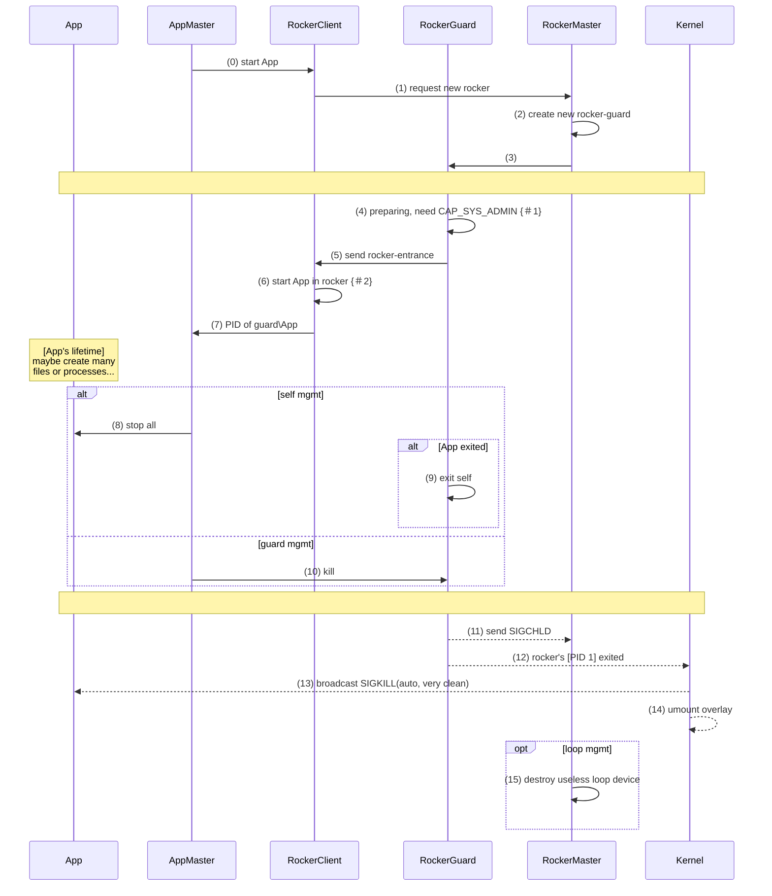
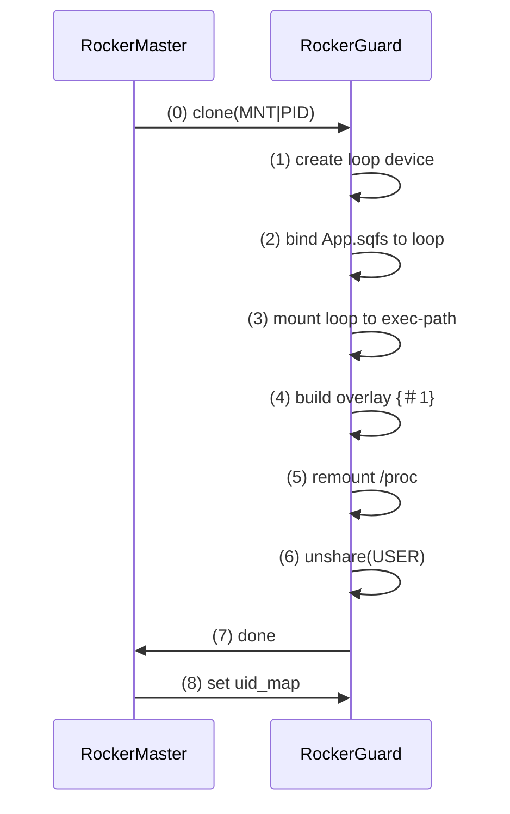
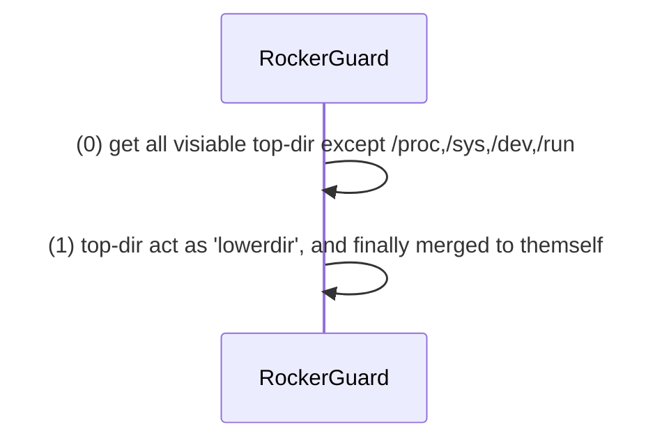
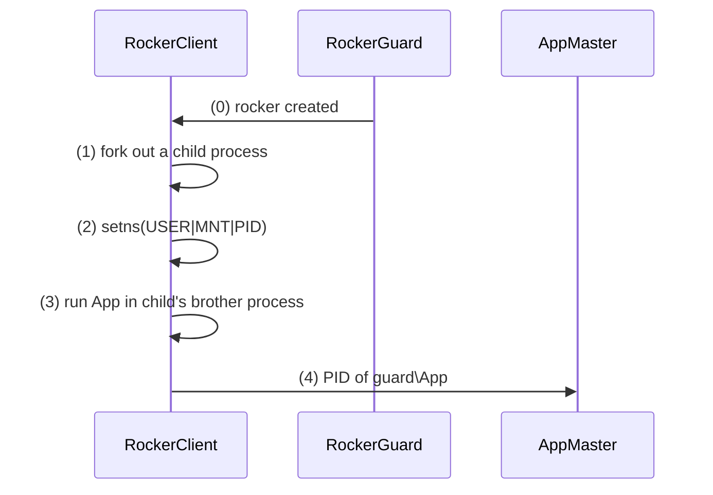
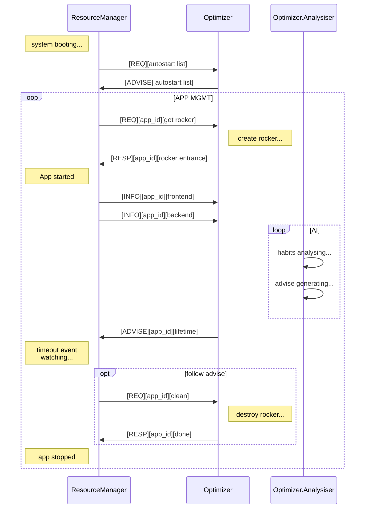

#### 1.1.1.1. RootGraph

```mermaid
sequenceDiagram
   participant A as App
   participant AM as AppMaster
   participant LJ as RockerClient
   participant JG as RockerGuard
   participant JM as RockerMaster
   participant K as Kernel

   AM ->> LJ: (0) start App
   LJ ->> JM: (1) request new rocker
   JM ->> JM: (2) create new rocker-guard
   JM ->> JG: (3)

   Note over A,K: #

   JG ->> JG: (4) preparing, need CAP_SYS_ADMIN {＃1}
   JG ->> LJ: (5) send rocker-entrance
   LJ ->> LJ: (6) start App in rocker {＃2}
   LJ ->> AM: (7) PID of guard\App
   Note over A: [App's lifetime]<br>maybe create many<br>files or processes...

   alt self mgmt
       AM ->> A: (8) stop all
       alt App exited
           JG ->> JG: (9) exit self
       end
   else guard mgmt
       AM ->> JG: (10) kill
   end

   Note over A,K: #

   JG -->> JM: (11) send SIGCHLD
   JG -->> K:  (12) rocker's [PID 1] exited
   K -->> A:   (13) broadcast SIGKILL(auto, very clean)
   K -->> K:   (14) umount overlay

   opt loop mgmt
       JM ->> JM: (15) destroy useless loop device
   end
```

#### 1.1.1.2. SubGraph {＃1}

```mermaid
sequenceDiagram
   participant JM as RockerMaster
   participant JG as RockerGuard

   JM ->> JG: (0) clone(MNT|PID)
   JG ->> JG: (1) create loop device
   JG ->> JG: (2) bind App.sqfs to loop
   JG ->> JG: (3) mount loop to exec-path
   JG ->> JG: (4) build overlay {＃1}
   JG ->> JG: (5) remount /proc
   JG ->> JG: (6) unshare(USER)
   JG ->> JM: (7) done
   JM ->> JG: (8) set uid_map
```

#### 1.1.1.3. SubGraph {＃1} {＃1}

```mermaid
sequenceDiagram
   participant JG as RockerGuard

   JG ->> JG: (0) get all visiable top-dir except /proc,/sys,/dev,/run
   JG ->> JG: (1) top-dir act as 'lowerdir', and finally merged to themself
```

#### 1.1.1.4. SubGraph {＃2}

```mermaid
sequenceDiagram
   participant JL as RockerClient
   participant JG as RockerGuard
   participant AM as AppMaster

   JG ->> JL: (0) rocker created
   JL ->> JL: (1) fork out a child process
   JL ->> JL: (2) setns(USER|MNT|PID)
   JL ->> JL: (3) run App in child's brother process
   JL ->> AM: (4) PID of guard\App
```

## 1.5. RoadMap

```mermaid
sequenceDiagram
    participant A as ResourceManager
    participant Z as Optimizer
    participant Y as Optimizer.Analysiser

    Note left of A: system booting...

    A->>Z: [REQ][autostart list]
    Z->>A: [ADVISE][autostart list]

    loop APP MGMT
        A->>Z: [REQ][app_id][get rocker]

        Note right of Z: create rocker...

        Z->>A: [RESP][app_id][rocker entrance]

        Note left of A: App started

            A->>Z: [INFO][app_id][frontend]
            A->>Z: [INFO][app_id][backend]

            loop AI
                Y ->> Y: habits analysing...
                Y ->> Y: advise generating...
            end

            Z->>A: [ADVISE][app_id][lifetime]

            Note left of A: timeout event<br/> watching...

        opt follow advise
            A->>Z: [REQ][app_id][clean]
            Note right of Z: destroy rocker...
            Z->>A: [RESP][app_id][done]
        end

        Note left of A: app stopped
    end
```

